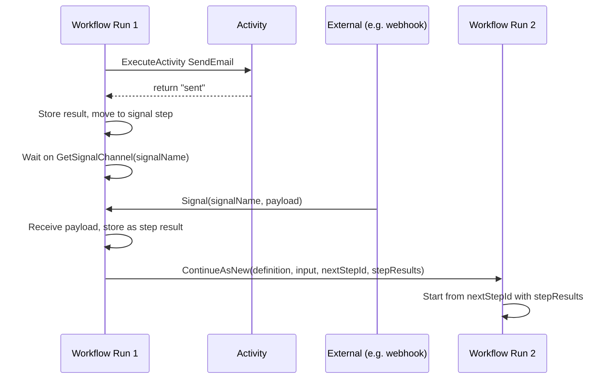

# Add "signal" step type with Continue-As-New

## Goal

- Support **async activities** where the real outcome arrives later via a **Temporal signal** (e.g. send email → wait for "delivered"/"opened"/"clicked").
- Use **Continue-As-New** when a signal is received: complete the current run and start a new run from the next step, passing accumulated state (definition, input, step results including the signal payload). This avoids long history and keeps signal handling deterministic.

## Flow (high level)




---

## 1. Workflow definition: add "signal" step type

**File:** [gosample/internal/workflows/general/workflow_def.go](gosample/internal/workflows/general/workflow_def.go)

- Add constant `StepTypeSignal = "signal"`.
- On **StepDef**, add optional field used only for signal steps:
  - `SignalName string` — Temporal signal name to wait for (e.g. `"email_outcome"`).
- Signal step reuses **NextStepID**: after receiving the signal we Continue-As-New and start from this next step.

**Example JSON for a signal step (after an activity like SendEmail):**

```json
"waitEmailOutcome": {
  "type": "signal",
  "signalName": "email_outcome",
  "nextStepId": "handleOutcome"
}
```

---

## 2. Workflow input: support resume state (for Continue-As-New)

**File:** [gosample/internal/workflows/general/dynamic_workflow.go](gosample/internal/workflows/general/dynamic_workflow.go) (and types)

- Extend **DynamicWorkflowInput** (in [workflow_def.go](gosample/internal/workflows/general/workflow_def.go) or next to DynamicWorkflow):
  - `StartStepID *string` — optional; when set (e.g. from Continue-As-New), start from this step instead of definition’s `startStepId`.
  - `InitialStepResults map[string]interface{}` — optional; when set, pre-populate `stepResults` so the new run has results from all previous steps (including the signal step’s payload).
- **Start logic:** If `InitialStepResults != nil`, use it to initialize `stepResults` and use `StartStepID` (or definition’s `startStepId`) as the first `currentID`. Otherwise keep current behavior (parse definition, validate, resolve start from definition).

---

## 3. Dynamic workflow: handle signal step and Continue-As-New

**File:** [gosample/internal/workflows/general/dynamic_workflow.go](gosample/internal/workflows/general/dynamic_workflow.go)

- In the main step loop, add branch for **StepTypeSignal**:
  1. Get channel: `workflow.GetSignalChannel(ctx, step.SignalName)`.
  2. Block on receive: receive the signal payload (e.g. into `[]byte` or a small struct, then unmarshal to `interface{}` for consistency with other step results).
  3. Store payload in `stepResults[currentID]`.
  4. Build resume input: same `Definition` and `Input`, set `StartStepID` to `step.NextStepID`, set `InitialStepResults` to current `stepResults` (including the signal step’s result).
  5. Return `workflow.NewContinueAsNewError(ctx, DynamicWorkflow, resumeInput)` so the workflow restarts from the next step with full state. Do not advance `currentID` and continue the loop; the current run ends here.
- **Determinism:** Receiving the signal and then returning `NewContinueAsNewError` from the main workflow body (not from a signal handler) is safe and deterministic.
- Optional later: support a **signal timeout** (e.g. `signalTimeoutSeconds` on the step) using `workflow.Select` with a timer channel; on timeout, either go to an optional `timeoutStepId` or fail. Not required for the first version.

---

## 4. Validation: signal step and cycles

**File:** [gosample/internal/workflows/general/validate.go](gosample/internal/workflows/general/validate.go)

- In **validateStep**, add `case StepTypeSignal`:
  - Require non-empty `SignalName`.
  - Require `NextStepID` to be set and to reference an existing step (so we always have a valid continue target).
- In **checkCycles**, for signal steps include `NextStepID` in the list of successor step IDs so cycles are still detected correctly.

---

## 5. Who sends the signal

Signals are sent from **outside** the workflow (e.g. API server, webhook handler) using the Temporal client:

- `client.SignalWorkflow(ctx, workflowID, runID, signalName, payload)`.
- The **workflow ID** must be known (e.g. chosen when starting the workflow; same ID is used after Continue-As-New). Run ID can be empty to target the current run.

No changes to the dynamic-starter are strictly required for the engine; adding a small helper or doc showing how to signal a running workflow (workflow ID + `signalName` from the JSON) would help.

---

## 6. Example flow (email)

- **Steps:** `sendEmail` (activity) → `waitEmailOutcome` (signal, `signalName: "email_outcome"`, `nextStepId: "handleOutcome"`) → `handleOutcome` (activity or condition).
- Run 1: Execute `sendEmail` → store result → run `waitEmailOutcome` → block on signal `"email_outcome"`. When webhook calls `SignalWorkflow(..., "email_outcome", {"event": "delivered", ...})`, workflow receives payload, stores it as result of `waitEmailOutcome`, then Continue-As-New with `StartStepID: "handleOutcome"` and `InitialStepResults: { "sendEmail": {...}, "waitEmailOutcome": {"event": "delivered", ...} }`.
- Run 2: Starts at `handleOutcome` with those step results; conditions can use `$.event` from the signal step result.

---

## Files to change (summary)


| File                                                                           | Changes                                                                                                                                                                            |
| ------------------------------------------------------------------------------ | ---------------------------------------------------------------------------------------------------------------------------------------------------------------------------------- |
| [workflow_def.go](gosample/internal/workflows/general/workflow_def.go)         | Add `StepTypeSignal`, add `SignalName` to `StepDef`. Extend input struct with `StartStepID`, `InitialStepResults` (or keep input in dynamic_workflow.go and extend there).         |
| [dynamic_workflow.go](gosample/internal/workflows/general/dynamic_workflow.go) | Seed state from `InitialStepResults`/`StartStepID` when present. In loop, add signal step: receive signal, store in stepResults, return `NewContinueAsNewError` with resume input. |
| [validate.go](gosample/internal/workflows/general/validate.go)                 | Validate signal step (`SignalName`, `NextStepID`). Include signal step in `checkCycles`.                                                                                           |


Optional: one example JSON under `configs/workflows/` (e.g. activity → signal → next step) and a short note or helper for signaling from a client.