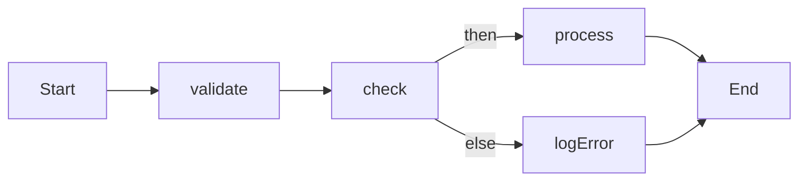

# JSON design for conditional multi-activity Temporal workflow

Use this JSON as the input to a **dynamic workflow** (e.g. in [gosample/internal/workflows/general/dynamic_workflow.go](gosample/internal/workflows/general/dynamic_workflow.go)) that interprets the document and runs activities in sequence or conditionally.

---

## 1. Top-level shape

```json
{
  "version": "1.0",
  "startStepId": "step1",
  "steps": { ... }
}
```

- **`version`** (string): Schema version for future evolution.
- **`startStepId`** (string, optional): First step to run. If omitted, first step in `steps` order is used (see edge cases).
- **`steps`** (object): Map of step ID → step definition. Order of keys is irrelevant; execution order is determined by `nextStepId` / condition branches.

---

## 2. Step types

Each step is one of: **activity** or **condition**.

### 2.1 Activity step

```json
{
  "step1": {
    "type": "activity",
    "name": "Greet",
    "input": { "name": "World" },
    "nextStepId": "step2",
    "timeoutSeconds": 10,
    "retryPolicy": { "maximumAttempts": 3, "backoffCoefficient": 2 }
  }
}
```

| Field | Type | Required | Notes |
|-------|------|----------|--------|
| `type` | string | yes | `"activity"` |
| `name` | string | yes | Registered activity name (e.g. `Greet`) |
| `input` | object / array / value | no | Static input. For dynamic input, use **references** (below). |
| `nextStepId` | string / null | no | Next step; `null` or omitted = end of flow. |
| `timeoutSeconds` | number | no | Activity timeout. |
| `retryPolicy` | object | no | `maximumAttempts`, `backoffCoefficient`, `initialIntervalSeconds`, `maximumIntervalSeconds`. |

### 2.2 Condition step

```json
{
  "checkStep": {
    "type": "condition",
    "left": { "type": "stepResult", "stepId": "step1", "path": "$.success" },
    "operator": "eq",
    "right": { "type": "literal", "value": true },
    "thenStepId": "stepOnSuccess",
    "elseStepId": "stepOnFailure"
  }
}
```

| Field | Type | Required | Notes |
|-------|------|----------|--------|
| `type` | string | yes | `"condition"` |
| `left` | reference or literal | yes | Left operand (see §3). |
| `operator` | string | yes | `eq`, `ne`, `gt`, `gte`, `lt`, `lte`, `in`, `notIn`, `exists`, `isEmpty`, `contains`. |
| `right` | reference or literal | no | Omitted for `exists` / `isEmpty`. |
| `thenStepId` | string / null | no | Step when condition is true. |
| `elseStepId` | string / null | no | Step when condition is false. |

**Edge case:** Both `thenStepId` and `elseStepId` can be `null` or omitted → workflow effectively ends on that branch.

---

## 3. References and literals (for condition operands and activity input)

Support **dynamic values** so conditions and activity inputs can use workflow input or previous step results.

### 3.1 Literal

```json
{ "type": "literal", "value": 42 }
{ "type": "literal", "value": "hello" }
{ "type": "literal", "value": true }
{ "type": "literal", "value": null }
```

### 3.2 Workflow input

```json
{ "type": "input", "path": "$.userId" }
{ "type": "input", "path": "$.options.retry" }
```

`path`: JSONPath (or dot path) into the workflow’s input payload.

### 3.3 Step result

```json
{ "type": "stepResult", "stepId": "step1" }
{ "type": "stepResult", "stepId": "step1", "path": "$.valid" }
```

- No `path`: entire activity result.
- With `path`: extract from that result (for struct/JSON output).

**Edge case:** Referencing a step that was not executed (wrong branch) → runtime error or explicit “unavailable” semantics; document and validate.

---

## 4. Activity input from previous result

Allow activity input to be a reference (same types as above) or a mix:

```json
"input": {
  "name": { "type": "stepResult", "stepId": "validateStep", "path": "$.normalizedName" },
  "count": { "type": "literal", "value": 1 }
}
```

**Edge case:** If `input` is a single reference, use object form: `{ "type": "stepResult", "stepId": "x" }` so the activity receives that value directly.

---

## 5. Full example: linear + condition

```json
{
  "version": "1.0",
  "startStepId": "validate",
  "steps": {
    "validate": {
      "type": "activity",
      "name": "ValidateInput",
      "input": { "type": "input" },
      "nextStepId": "check"
    },
    "check": {
      "type": "condition",
      "left": { "type": "stepResult", "stepId": "validate", "path": "$.valid" },
      "operator": "eq",
      "right": { "type": "literal", "value": true },
      "thenStepId": "process",
      "elseStepId": "logError"
    },
    "process": {
      "type": "activity",
      "name": "Process",
      "input": { "type": "stepResult", "stepId": "validate" },
      "nextStepId": null
    },
    "logError": {
      "type": "activity",
      "name": "LogError",
      "input": { "type": "stepResult", "stepId": "validate", "path": "$.error" },
      "nextStepId": null
    }
  }
}
```

---

## 6. Edge cases (summary)

| Case | Handling in JSON |
|------|-------------------|
| **Empty workflow** | `steps: {}` and no `startStepId`, or `startStepId: null`. Runtime: no-op or error. |
| **Single activity** | One step, no `nextStepId` (or `null`). |
| **Linear chain** | Each step has `nextStepId` to the next; last has `null`/omitted. |
| **Condition with only then** | Set `elseStepId: null` or omit; else branch ends. |
| **Condition with only else** | Set `thenStepId: null` or omit. |
| **Nested conditions** | `thenStepId` / `elseStepId` point to another condition step. |
| **Missing next (end of flow)** | `nextStepId` null or omitted. |
| **Unreachable steps** | Valid JSON; validator can warn if a step is never referenced. |
| **Cycles** | Allowed only if you add loop semantics (e.g. max iterations); otherwise validator rejects. |
| **Invalid step reference** | `nextStepId` / `thenStepId` / `elseStepId` must exist in `steps`; validate at start. |
| **Reference to step on other branch** | Allowed; runtime must evaluate only references for steps that were executed (determinism). |
| **Optional timeout/retry** | Omit `timeoutSeconds` / `retryPolicy` for defaults. |
| **Empty or null input** | `"input": null`, `"input": {}`, or omit; activity receives zero args or empty. |
| **Condition on workflow input** | Use `{ "type": "input", "path": "$.field" }` for `left`/`right`. |
| **Multiple operators** | Support list above; unknown operator → validation error. |
| **No startStepId** | If one step: treat it as start. If multiple: require `startStepId` or define “first” by order (e.g. first key in `steps`). |

---

## 7. Optional: parallel branch (future)

If you later add parallel execution:

```json
{
  "type": "parallel",
  "branchStepIds": ["stepA", "stepB"],
  "join": "all",
  "nextStepId": "afterParallel"
}
```

- `join`: `"all"` (wait for all) or `"any"` (first to complete).
- Edge cases: empty `branchStepIds`, single branch, failure of one branch (fail fast vs. collect errors).

---

## 8. Validation checklist (implementation)

- Every `nextStepId`, `thenStepId`, `elseStepId` is either `null`/omitted or a key in `steps`.
- `startStepId` (if present) is a key in `steps`.
- Every step has valid `type` (`activity` | `condition`).
- Activity steps have `name`; condition steps have `left`, `operator`, and `right` (unless operator is `exists`/`isEmpty`).
- References: `stepId` in `stepResult` exists; `path` syntax is valid.
- No cycles unless explicitly supported (and then limit depth/iterations).

---

## 9. Mermaid: flow from example JSON



This design gives you a single JSON format that supports multiple activities, one or more condition-check steps, and the edge cases above; the dynamic workflow in Go would parse this and execute activities / evaluate conditions accordingly.